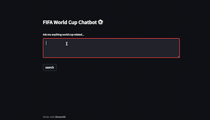

## FIFA World Cup Q/A System  

basic streamlit demo

----

Tailored specifically for World Cup questions (entirety of Wikipedia world-cup related articles were embedded), and generally seems to work better than a google search in many instances

Wikipedia dataset can be found in `data/world_cup_data.csv` and embeddings (python dict) in `data/world_cup_embeddings.pkl`

Most of the process flow is taken from [this OpenAI repo](https://github.com/openai/openai-cookbook/blob/main/examples/Question_answering_using_embeddings.ipynb) 

----

Basic framework: 

1. crawl wikipedia for all "FIFA world cup" related documents 
2. split documents into sections 
3. embed each sections content with (the now incredibly cheap) `text-embedding-ada-002` model from OpenAI 
4. now, given a new query $Q$: 
    1. embed $Q$ with `text-embedding-ada-002` 
    2. find matching documents through vector similarity metrics 
    3. append content of matched documents to prompt to feed into `text-davinci-003` (or `text-davinci-002`, doesn't matter)

Note that steps 1,2,3 are done only once offline, and step 4 is what takes place when a new query comes in 

----- 

### Usage (to run locally) 

clone repo, and then: 

1. generate OpenAI API key
2. in terminal, `mkdir streamlit/` then `touch streamlit/secrets.toml`
3. add your OpenAI API key to `streamlit/secrets.toml` like `OPEN_AI_KEY="<KEY>"`
4. in terminal, `streamlit run app.py` 

